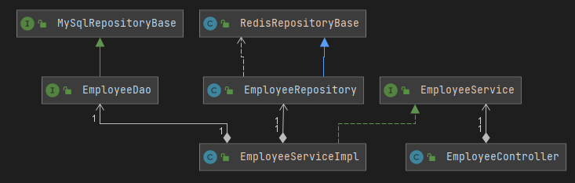

# practice-spring-chat

### Wiki
https://everysing.atlassian.net/wiki/spaces/BE/pages/902594569

### mysql 설치
docker run -p 3306:3306 --name mysql -e MYSQL_ROOT_PASSWORD=1234 -d mysql:5.7

### mosquitto 설치
docker run -it -p 1883:1883 -p 9001:9001 --name mosquitto eclipse-mosquitto

### mosquitto websockets 설정
vi /mosquitto/config/mosquitto.conf  
listener 9001  
protocol websockets  

### redis 설치
docker run --name redis -p 6379:6379 -d redis

### 클래스 기본구조

